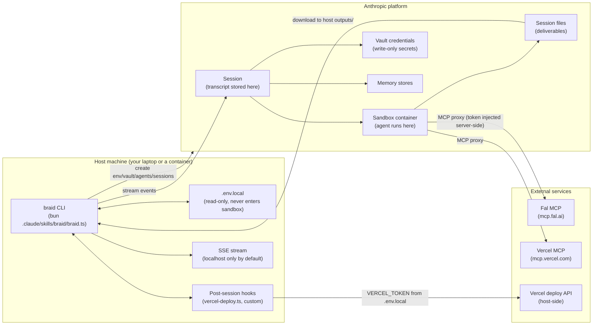

# Braid architecture

> A 30-second topology + trust-boundary map. For prose-depth design, read [`SKILL.md`](../.claude/skills/braid/SKILL.md). For the disclosure posture, read [`SECURITY.md`](../SECURITY.md). For operational fixes, read [`troubleshooting.md`](./troubleshooting.md). For money, read [`costs.md`](./costs.md).

## Topology

## Trust boundaries

Three layers, each strictly bounded:

| Boundary | Trusts | Doesn't trust | Enforcement |
|---|---|---|---|
| **Host process** | `.env.local`, the user's filesystem | Anything from the sandbox | Slice 70 container ([Dockerfile](../Dockerfile), [docker-compose.yml](../docker-compose.yml)) limits mounts + capabilities |
| **Anthropic session/transcript** | Vault-proxied credentials | Sandbox-resident state | Vault credentials never enter the sandbox |
| **Sandbox container (Anthropic-managed)** | Vault-injected token headers | Anything in agent context | `networking: limited` + `permission_policy: always_ask` by default (Slice 10 §1.F1, §1.F3) |

The single biggest invariant: **a token in the agent's context window is exfiltratable.** Every secret-handling decision flows from this. Authority: [Pluto Security](https://pluto.security/blog/inside-claude-managed-agents/) + [Anthropic vaults](https://platform.claude.com/docs/en/managed-agents/vaults).

## Data flow — single run

1. **Brief expansion (host).** `expandBrief` substitutes `{{file:relpath}}` (sandboxed to the flow directory per Slice 10 §1.F4) and rejects `{{env:...}}` outright (Slice 10 §1.F2).
2. **Resource provisioning (host → Anthropic).** `ensureResources` creates Environment, Vault + credentials (host validates MCP URL against allowlist per §1.F5), Memory Stores, Agents. State IDs persist to `flows/<flow>/state.json`.
3. **Session creation (host → Anthropic).** Director agent + vault references + memory store resources.
4. **Event stream (Anthropic → host).** `agent.message`, `agent.tool_use`, `span.outcome_evaluation_end`, `session.status_*` events.
5. **Recovery (if applicable).** Stall watchdog → sentinel diagnosis → recovery nudge (Slice 20 §2.A3). Stream drop → exponential backoff (Slice 50). Each is logged via SSE.
6. **Terminal event.** `session_idle` (success), `session_terminated` (abnormal), or `watchdog_giveup` (stall). Tracked as `terminalTrigger`.
7. **File download (Anthropic → host).** `downloadSessionFiles` writes deliverables to `outputs/<flow>/<date>-<sid>/`.
8. **Run log (host → memory store).** If `run.log_runs: true`, write a summary to the `runLog` store.
9. **Reflection (Slice 100).** If `run.reflection` is configured AND the trigger is `session_idle`, the named reflector agent reads the trajectory + outcome + saved-FILE-LIST (never contents) and writes patterns to the target store.
10. **Post-session hook (Slice 10 F2).** If `run.post_session_hook` is configured, run it on the **host** with `env_passthrough` allowlist only — VERCEL_TOKEN, etc. The token never enters the agent context.

## Key code paths

| Layer | File | Role |
|---|---|---|
| CLI entry | `.claude/skills/braid/braid.ts` | Subcommand dispatch (list, setup, run, demo, sessions, pull, dream, purge) |
| Orchestration | `.claude/skills/braid/lib.ts` | Pure helpers + Anthropic SDK orchestration |
| SDK shim | `.claude/skills/braid/sdk-adapter.ts` | Single `c.beta as unknown` cast for memoryStores (Slice 20 §2.A4) |
| Mock | `.claude/skills/braid/mocks/anthropic.ts` | Demo mode + test SDK fake (Slice 80) |
| Schemas | `.claude/skills/braid/flow.schema.json`, `agent.schema.json` | flow.yaml + agent.yaml validation (Slice 30, Slice 90) |
| Hooks | `.claude/skills/braid/post-hooks/vercel-deploy.ts` | Reference host-side deploy hook (Slice 10 F2) |
| Scaffolder | `.claude/skills/braid/scripts/new-agent.ts` | Template-based agent creation (Slice 90) |

## What's invariant across all flows

- Brief substitutions resolve before any agent sees them (host-side).
- Vault credentials never enter the sandbox.
- The orchestrator's host network egress is the container's network policy (Slice 70).
- Reflection writes patterns, never raw data (Slice 100 security decision).
- Post-session hooks run with a strict env scope (`PATH` + `BRAID_*` + `env_passthrough` only).

---

*Architecture last updated 2026-05-15. Mermaid renders natively on GitHub.*
